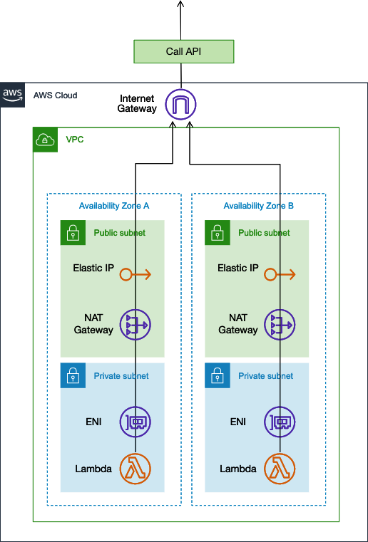

## fixed-ip-function

fixed ip lambda using VPC, NAT GateWay, Elastic IP, etc.

The blog is below;

Create fixed(Elastic) IP lambda in just 3 minutes. | by Kohei Watanabe | Jan, 2022 | Medium
https://medium.com/@littlewat.dev/create-fixed-elastic-ip-lambda-in-just-3-minutes-f9e6593fa74f

### fixed IP VPC Lambda
- [Lambdaから固定IPアドレスでkintoneと連携する方法 \| キントマニア \| kintone活用ブログ](https://www.joyzo.co.jp/blog/2325)
- [Deploy AWS Lambda to VPC with Terraform](https://www.maxivanov.io/deploy-aws-lambda-to-vpc-with-terraform/)